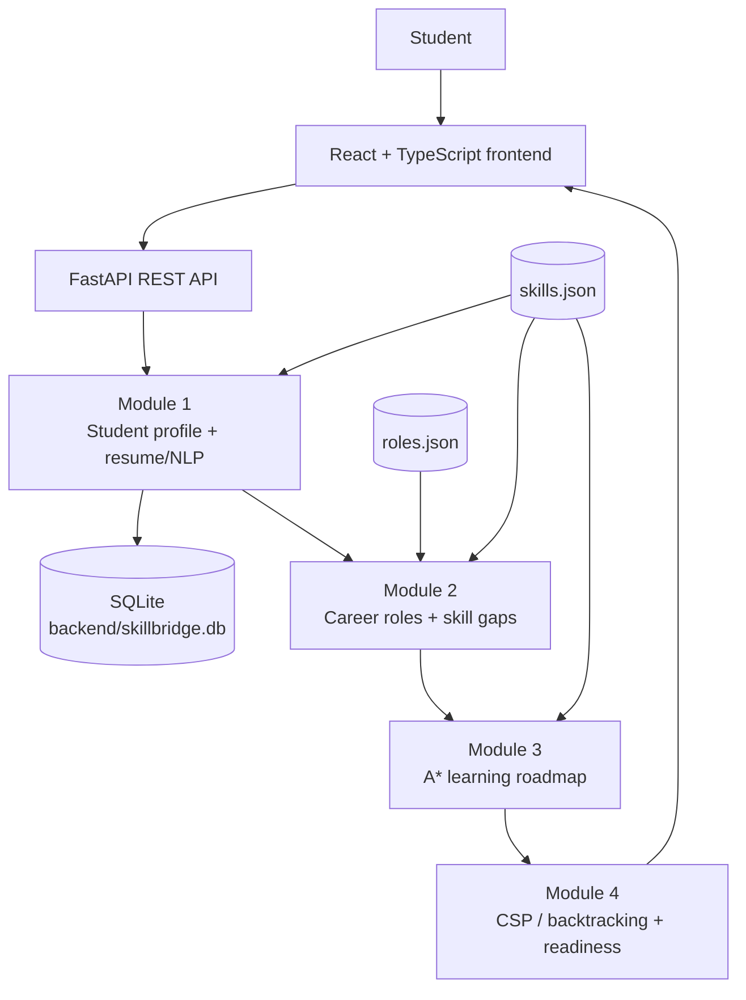

# <div align="center">SkillBridge AI</div>

<div align="center">

### Intelligent career guidance from skills to readiness

SkillBridge helps students turn their current profile and resume into a measurable path toward a selected career role—with explainable skill gaps, an A* learning roadmap, and deterministic readiness analysis.

<br />

[](https://www.python.org/)
[](https://fastapi.tiangolo.com/)
[](https://react.dev/)
[](https://www.typescriptlang.org/)
[](https://www.sqlite.org/)
[](#testing)

**Repository:** [github.com/krishnakumar5757/SkillBridgeAI](https://github.com/krishnakumar5757/SkillBridgeAI)

</div>

## ✨ What is SkillBridge?

SkillBridge is a local full-stack career-readiness platform for students and early-career learners. It combines a student profile, resume-derived skills, a small role and skill catalog, heuristic learning-path search, and constraint-based analysis in one focused dashboard.

The core journey is:

```text
Student profile
      ↓
Resume upload + skill extraction
      ↓
Target career role selection
      ↓
Skill-gap analysis
      ↓
A* personalized learning roadmap
      ↓
CSP / backtracking constraint solving
      ↓
Career-readiness score and explanation
      ↓
Dashboard
```

> **Scope note:** the current implementation provides a career-role catalog and target-role selection. It does not claim an autonomous, model-generated career recommendation engine.

## 🚀 Current capabilities

| Capability | What is implemented |
| --- | --- |
| Student intelligence | Create and restore a student profile, academic information, interests, projects, and self-reported skills |
| Resume processing | Upload PDF, DOCX, or TXT resumes; extract text; identify vocabulary-backed skills; infer a basic proficiency level |
| Skill normalization | Match skill mentions and aliases to canonical entries in `data/skills/skills.json` |
| Career intelligence | Browse the role catalog, select a target role, and compare profile skills with required proficiency levels |
| Skill-gap analysis | Classify required skills as strong, weak, or missing; calculate overall, core, and critical coverage |
| Learning intelligence | Generate a role-specific roadmap using an actual A* search over a skill graph |
| Constraint solving | Use CSP / recursive backtracking with MRV and constraint checks to produce a valid ordered skill assignment where possible |
| Career readiness | Produce a deterministic 0–100 score with coverage, proficiency, strengths, gaps, recommendations, and a readable summary |
| Dashboard | Navigate profile, skills, career analysis, roadmap, readiness, and health views from the React interface |
| Persistence | Store student and skill data in SQLite; retain the current student and selected role in browser `localStorage` for the local workflow |

## 🏗️ Architecture



The backend exposes module-oriented routers under `/api/v1`. The frontend uses Vite's development proxy to forward `/api`, `/health`, and `/docs` requests to the FastAPI server on port `8000`. The current readiness pipeline uses deterministic scoring and CSP/backtracking; Forward Chaining is not implemented in the current application.

## 🔄 End-to-end workflow

| Stage | Input | Processing | Output |
| --- | --- | --- | --- |
| 1. Profile | Name, email, academic details, interests, projects, self-reported skills | Validate and persist student data | Student identity and profile records |
| 2. Resume | PDF, DOCX, or TXT file | Extract text; spaCy EntityRuler and noun-chunk processing identify candidate mentions; aliases are normalized | Resume metadata, extracted text, resume-derived skills |
| 3. Career target | A role from the local role catalog | Load required skills, minimum proficiency, priority, and core-skill flags | Selected target role |
| 4. Skill gap | Student skill records + role requirements | Compare proficiency ranks and prioritize gaps | Strong, weak, missing skills and coverage metrics |
| 5. Roadmap | Current skill state + target role | Build a skill graph and run A* using learning costs and a heuristic | Ordered learning steps, costs, search metrics, and goal status |
| 6. Constraint solving | Skills still needed for the role | Assign proficiency values while checking constraints with recursive backtracking and MRV | Valid ordered assignments or an explicit failure reason |
| 7. Readiness | Profile skills + role requirements | Calculate weighted coverage/proficiency/core-skill score and summarize evidence | Score, level, strengths, priority gaps, and recommendations |

## 🧠 Intelligence behind SkillBridge

### Resume / NLP extraction

Resume handling is deterministic and vocabulary-backed rather than an external generative-AI call. The service accepts PDF, DOCX, and TXT files, extracts text with the appropriate parser, and processes it through spaCy. A custom `EntityRuler` is seeded from the skill vocabulary and noun chunks provide additional candidates. The normalizer maps recognized aliases to canonical skills and keeps the highest-confidence match. Proficiency is inferred from nearby text using indicators such as “expert”, “advanced”, “proficient”, and “working knowledge”; otherwise it defaults to beginner.

### Career roles and recommendation boundary

Roles are loaded from `data/roles/roles.json`. The current catalog contains **Software Engineer**, **Data Analyst**, and **Frontend Developer**. The UI lets a student choose a target role and then runs analysis against that role. This is role selection and matching—not an unimplemented claim of AI-ranked career recommendations.

### Skill-gap analysis

The service normalizes role requirements to database skills, maps beginner/intermediate/advanced to numeric ranks, and compares the student's best available skill evidence with each requirement. A requirement is:

- **Strong** when the student's proficiency meets or exceeds the minimum.
- **Weak** when it is one proficiency level below.
- **Missing** when it is absent or two or more levels below.

Reports also include overall, core, and critical coverage plus prioritized weak and missing skills.

### A* learning roadmap

The roadmap engine in `modules/module-3-learning-intelligence/astar/` contains an explicit directed skill graph, `SkillNode` and `SkillEdge` structures, a priority queue, cost accumulation, heuristic estimates, closed-set tracking, and path reconstruction.

At a high level:

```text
f(n) = g(n) + h(n)
```

- `g(n)` is the accumulated learning cost.
- `h(n)` estimates remaining cost from proficiency gaps and learning costs.
- The graph connects the student's current state to role-required skills while considering available transitions and prerequisites.
- The search expands the lowest estimated total-cost state and reconstructs ordered learning steps.

The current `skills.json` catalog does not provide explicit `learning_cost_hours` values, so the implementation uses its documented fallback cost behavior. The API returns the roadmap, estimated cost, nodes expanded, search depth, and whether the target state was reached.

### CSP / backtracking constraint solving

Module 4 also exposes a genuine constraint solver in `modules/module-4-career-readiness/backtracking-csp/`. It creates variables for skills the student still needs, assigns proficiency values from each variable's domain, selects variables with the **Minimum Remaining Values (MRV)** heuristic, checks constraints after each assignment, and recursively backtracks when an assignment is inconsistent. The integration checks required-skill, prerequisite/core, conflict, and dependency constraints where configured, then returns the solver's ordered selected skills. In the current API integration, prerequisite/dependency maps are not supplied to the generic solver, so the fallback ordering is deterministic rather than a claimed prerequisite topological order.

### Career readiness

Readiness is calculated from the selected role's requirements and the student's stored skills—not from generated exam questions. The current weighted model combines skill coverage (40%), proficiency match (40%), core-skill coverage (15%), and a gap penalty capped at 5 score points. The API currently classifies results as **Ready**, **Nearly Ready**, **Developing**, or **Not Ready**, with the score breakdown, evidence, gaps, and recommendations included in the response.

## 🧰 Technology stack

| Area | Technologies in the repository |
| --- | --- |
| Frontend | React 18, TypeScript, React Router, Vite |
| Backend | Python, FastAPI, Uvicorn, Pydantic Settings |
| Persistence | SQLAlchemy 2.x, Alembic, SQLite |
| Resume / NLP | spaCy, EntityRuler, PDF/DOCX/TXT extraction adapters |
| Algorithms | A* search; CSP recursive backtracking with MRV |
| Testing | pytest, pytest-asyncio, Vitest, Testing Library, jsdom |
| Development tools | Ruff, npm, Vite development proxy |

## 📁 Repository structure

```text
Skillbridge/
├── backend/
│   ├── app/
│   │   ├── core/                 # Configuration, database, logging, security
│   │   ├── models/               # SQLAlchemy student and skill models
│   │   ├── nlp/                  # spaCy processing pipeline
│   │   ├── routes/               # FastAPI module and health routes
│   │   ├── services/             # Profile, gap, roadmap, CSP, readiness services
│   │   └── skill_extraction/     # Extraction and normalization
│   ├── tests/                    # Backend pytest suite
│   └── requirements.txt
├── frontend/
│   ├── src/
│   │   ├── components/           # Shared layout and navigation
│   │   ├── modules/              # Student-profile UI and API service
│   │   ├── pages/                # Dashboard, career, roadmap, readiness, health
│   │   └── services/             # Typed API client
│   └── package.json
├── modules/
│   ├── module-3-learning-intelligence/astar/
│   └── module-4-career-readiness/backtracking-csp/
├── data/
│   ├── roles/roles.json          # Career role requirements
│   └── skills/skills.json        # Canonical skills and aliases
├── docs/                         # Architecture, module, API, and development notes
├── PROJECT_SPEC.md               # Functional project specification
├── AGENTS.md                     # Project engineering standards
└── .env.example                  # Local configuration template
```

## ⚙️ Local setup — Windows PowerShell

### Prerequisites

- Python 3.11 or newer
- Node.js and npm

### 1. Clone the repository

```powershell
git clone https://github.com/krishnakumar5757/SkillBridgeAI.git
Set-Location .\SkillBridgeAI
```

### 2. Configure local environment values

From the repository root:

```powershell
Copy-Item .env.example .env
```

Keep `.env` local. For a non-debug run, replace the placeholder `JWT_SECRET` with a strong secret. The default development database URL resolves to `backend/skillbridge.db`.

### 3. Install and run the backend

Run the backend from the cloned repository's `backend` directory:

```powershell
Set-Location .\backend
python -m venv .venv
.\.venv\Scripts\Activate.ps1
python -m pip install --upgrade pip
pip install -r requirements.txt
uvicorn app.main:app --reload --host 0.0.0.0 --port 8000
```

The API is available at <http://localhost:8000>. Interactive OpenAPI documentation is at <http://localhost:8000/docs>, and the database-aware health check is at <http://localhost:8000/health>.

Resume NLP processing expects the configured spaCy model (`en_core_web_sm`). If it is not already installed in the environment, install it with:

```powershell
python -m spacy download en_core_web_sm
```

### 4. Install and run the frontend

Open a second PowerShell window from the repository root:

```powershell
Set-Location .\frontend
npm install
npm run dev
```

The Vite development server runs at <http://localhost:5173> and proxies API requests to the backend.

## 🔌 API overview

All endpoints below use the `/api/v1` prefix unless noted otherwise. `student_id` and `role_id` are query parameters for the analysis endpoints.

| Method | Endpoint | Purpose |
| --- | --- | --- |
| `POST` | `/api/v1/skill-gap/analyze?student_id={id}&role_id={role}` | Analyze strong, weak, missing, and prioritized skills |
| `POST` | `/api/v1/skill-gap/report?student_id={id}&role_id={role}` | Return the complete skill-gap report |
| `POST` | `/api/v1/learning-roadmap/generate?student_id={id}&role_id={role}` | Generate an A* learning roadmap |
| `POST` | `/api/v1/career-readiness/analyze?student_id={id}&role_id={role}` | Calculate and explain readiness |
| `POST` | `/api/v1/csp/solve?student_id={id}&role_id={role}` | Run CSP / backtracking with MRV |
| `POST` | `/api/v1/students/{student_id}/resumes/upload` | Upload and process a resume as multipart form data |
| `GET` | `/api/v1/career-roles` | List available roles |
| `GET` | `/api/v1/career-roles/{role_id}` | View role requirements |
| `GET` | `/health` | Check application and database connectivity |

Additional profile, academic, interest, project, skill, and resume retrieval routes are available in the FastAPI Swagger UI at `/docs`.

## 🗄️ Database and local data

The default configuration uses SQLite through SQLAlchemy. The deterministic local database path is:

```text
backend/skillbridge.db
```

Role and skill definitions are file-backed under `data/roles/` and `data/skills/`. Uploaded resumes are stored under the configured local `UPLOAD_DIR` (default: `./uploads`). These are development-oriented local persistence choices, not a hosted production deployment.

## ✅ Testing

The final stabilization results documented for this repository are:

| Area | Result |
| --- | ---: |
| Backend pytest suite | **74 passed** |
| Frontend Vitest suite | **12 passed** |
| Frontend TypeScript typecheck | **Passed** |
| Frontend production build | **Passed** |

Run the project checks with:

```powershell
# From backend/
pytest

# From frontend/
npm test
npm run typecheck
npm run build
```

No browser end-to-end test run is claimed here.

## ⚠️ Current limitations

- Browser E2E verification has not been performed.
- `data/skills/skills.json` does not currently provide explicit `learning_cost_hours`; A* therefore uses the existing fallback cost behavior.
- Resume validation relies on the client-provided MIME type in addition to the supported file extensions.
- The local role and skill catalogs are intentionally small, so some complete career-path scenarios have limited data.
- The current frontend persists the student ID and selected role in browser `localStorage`; this is continuity for the local workflow, not a complete authenticated account system.

## 🔭 Future improvements

Possible follow-up work—clearly outside the current implementation—includes:

- Expand the role and canonical skill datasets.
- Add explicit learning-cost metadata and richer prerequisite relationships.
- Strengthen resume validation with content/signature checks and safer upload isolation.
- Add browser E2E automation.
- Add CI/CD and deployment configuration.
- Add a dedicated, authenticated multi-user workflow if the product scope requires it.

## 🔐 Security and configuration

- Keep `.env` files, JWT secrets, API keys, local databases, and uploaded resumes out of version control.
- Use `.env.example` as the configuration template; never copy real secret values into documentation.
- For non-debug runs, configure a strong `JWT_SECRET`; the backend refuses insecure placeholder/short values outside debug mode.
- Treat resumes and student information as sensitive local application data.

## 🤝 Contributing

For a focused contribution:

1. Create a branch from the current default branch.
2. Keep changes within the relevant module and preserve the documented data flow.
3. Add or update tests for meaningful behavior changes.
4. Run the backend and frontend checks locally.
5. Open a pull request describing the change and verification performed.

Please read `PROJECT_SPEC.md` and `AGENTS.md` before making architectural or scope changes.

## 📄 License

No `LICENSE` file is currently included in the repository. No license is claimed here.

## 👤 Project

**SkillBridge AI** is maintained in the [SkillBridgeAI repository](https://github.com/krishnakumar5757/SkillBridgeAI) by **Krishna Kumar**.

<div align="center">

Built to make career preparation more measurable, explainable, and actionable.

</div>
